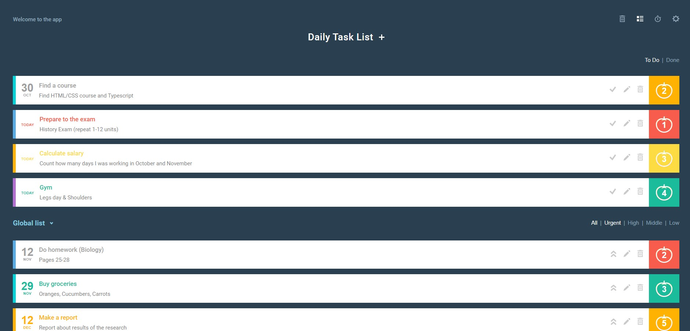
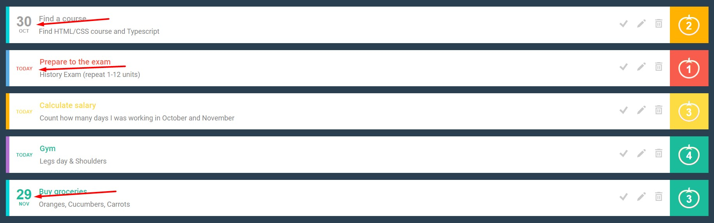
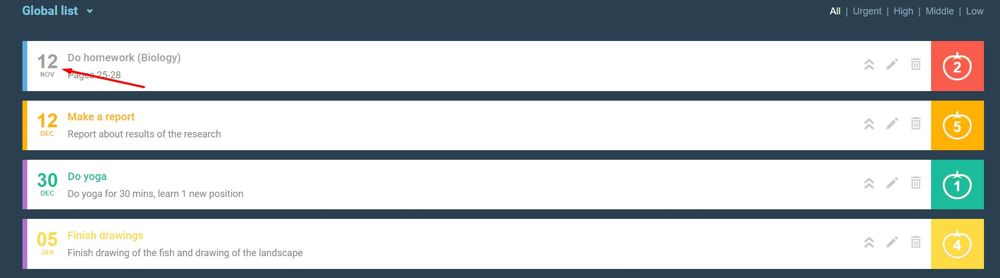
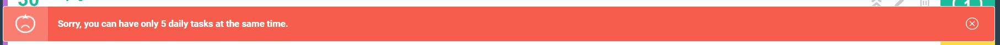
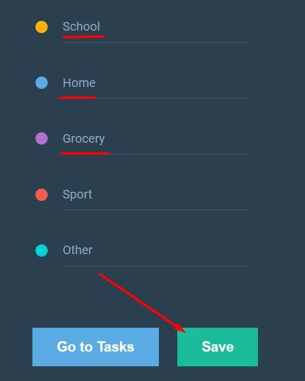
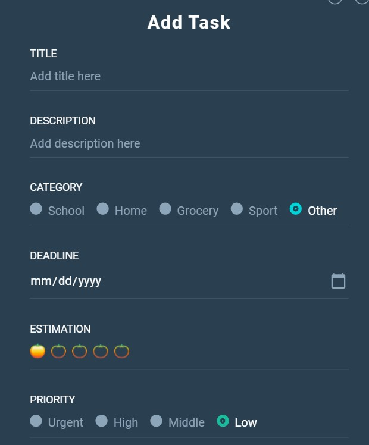
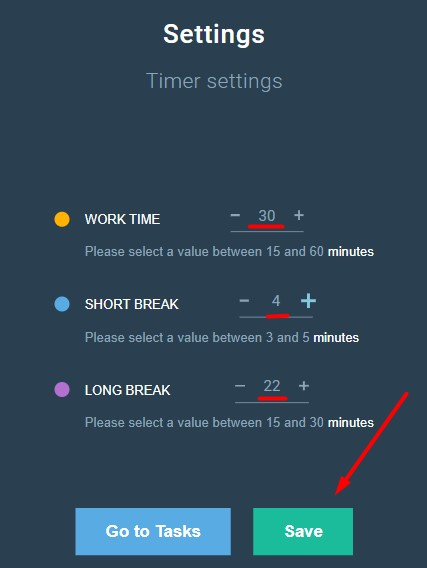
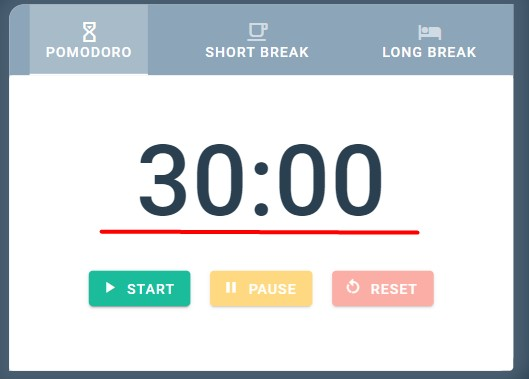
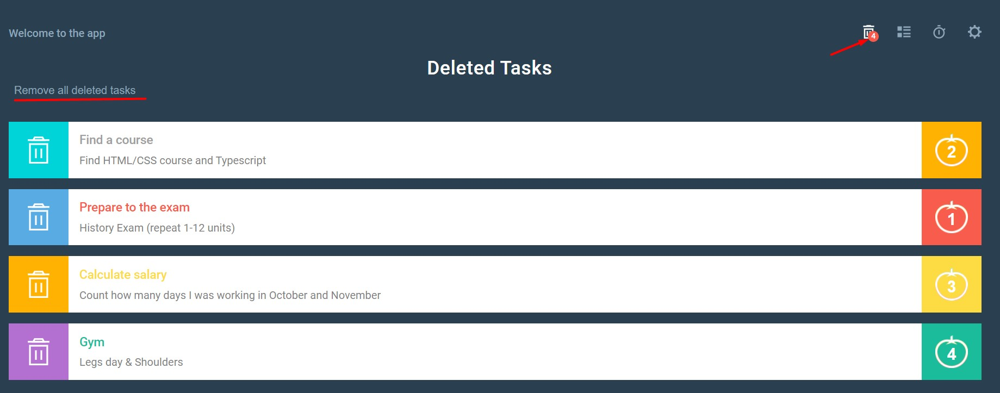

# TODO-POMODORO & TIMER



## 📋 Project Description

Hi! 👋
This project has a main goal to keep you productive.

You can use it to keep track of all your tasks.
For those tasks that require time-controlling (for instance, you have to learn something for 30 minutes per day) you can use a timer.

In the app you can:

- Create new todos;
- Delete todos;
- Edit todos;
- Tick done when you finished the task;
- Push todos from global todos (store for all todos) into daily todos (todos that is more important and should be done in the first place);
- Push todos into a timer page, if it is required time-controlling;
- Open a timer to track how many minutes/hours you'd been working;
- Change timer settings and adjust them for your needs;
- Change category names; (as a default categories are: Work, Education, Hobby, Sport, Other) if you need other names for any category you can change it in the settings;

💻 This project was created via:

- Vue 2;
- Vuetify;
- Vuex;

## Features that you may like:

### Sorted list of all tasks (global, daily, deleted, done)



All task are sorted by the deadline. It means if you have 3 tasks:

- the 1st task has deadline on 22nd of October;
- the 2nd task has deadline on 20th of October;
- the 3rd task has deadline on 25th of October;

you will get:

- the 2nd task;
- the 1st task;
- the 3rd task;

and if the deadline is today you will see "TODAY" in your task;

---

### Expired tasks

If the task is expired (deadline is already gone), the task will be in grey color



---

### Putting a task to a page with a timer

To put a task on a page with a timer (to easily control working time of the task you need), just press on the right-side colored square with an apple.


---

### Notifications to encrease User Experience

You see this notification when you successfully edited a task


---

You see this notification when you tried to put more than 5 daily tasks


---

You see this notification when you tried to put second task on a timer page;
So you can work only with 1 todo on a timer page at a time;


---

You see this notification when you've done a task;


---

### Changing category names

You can change category names if some of them aren't suitable for you;



And changed category names you can see when you're creating a new todo task;


---

### Changing timer settings

You can adjust time for timer (Pomodoro / Short Break / Long Break) in the settings;


As soon as you pressed 'Save' Button, you will be redirected to the timer page with new time;


---

### Removing all deleting tasks in 1 click

If you have many tasks which should be deleted from Deleted Page, instead of deleting tasks 1 by 1, just click on the 'Remove all deleted tasks' and tasks will be gone in a click!



But if you need to delete exact task just press on the left side square;


The same you can do with tasks which already done. You can delete them 1 by 1 or do it in one click.

## Project setup

```
npm install
```

### Compiles and hot-reloads for development

```
npm run serve
```

### Compiles and minifies for production

```
npm run build
```

### Lints and fixes files

```
npm run lint
```

### Customize configuration

See [Configuration Reference](https://cli.vuejs.org/config/).
